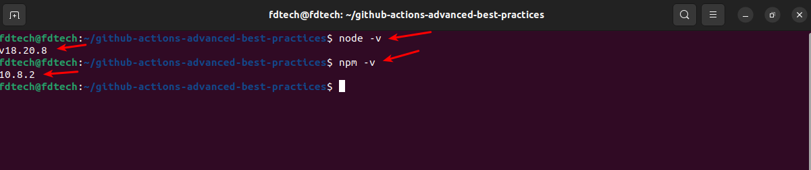
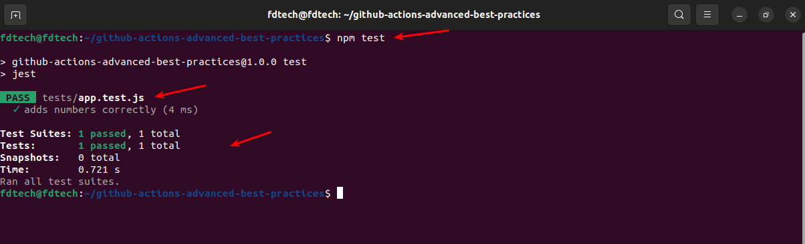
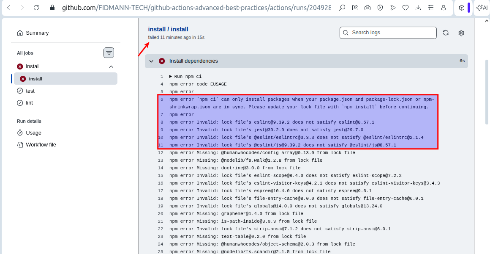
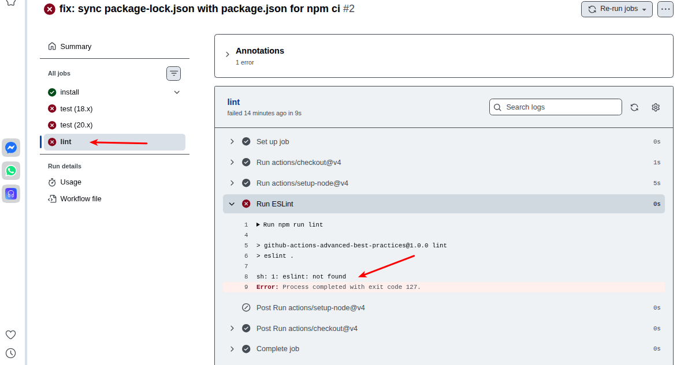
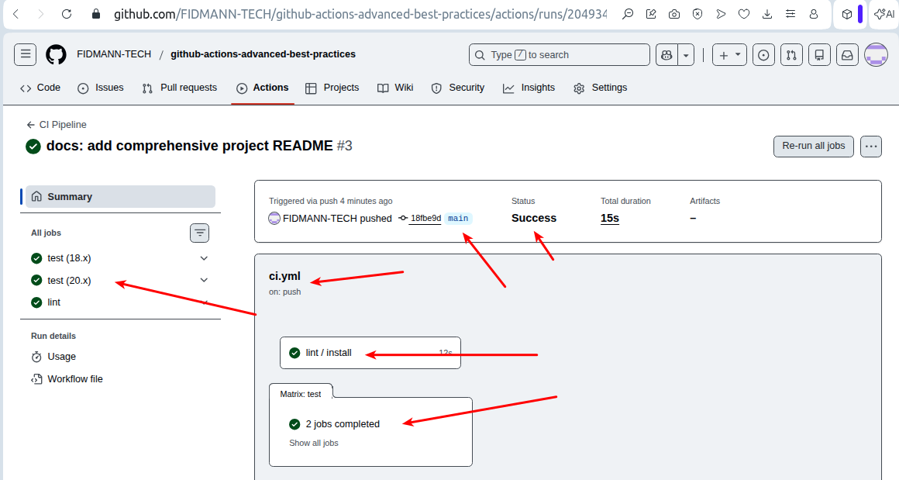
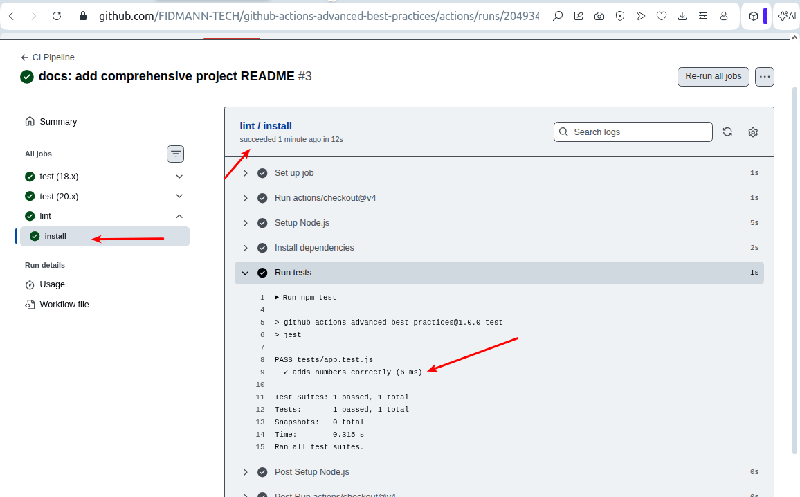
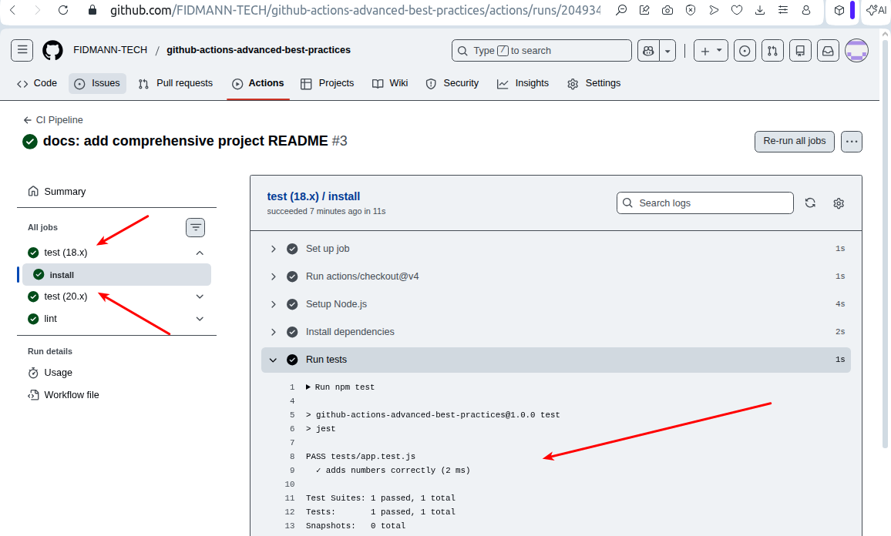

# GitHub Actions – Advanced Concepts & Best Practices

## 📌 Project Overview
This project demonstrates advanced GitHub Actions concepts focused on building **maintainable, modular, performant, and secure CI workflows**.

It reflects how professional DevOps teams design and optimize GitHub Actions pipelines in real production environments.

---

## 🎯 Learning Objectives

### Maintainable Workflows
- Clear and descriptive workflow names
- Self-documented YAML configurations
- Reduced duplication using reusable workflows

### Code Organisation & Modular Design
- Logical workflow separation
- Reusable workflow components
- Scalable repository structure

### Performance Optimization
- Parallel job execution
- Matrix builds for compatibility
- Dependency caching for faster runs

### Security Best Practices
- Least-privilege permissions
- Secure secret handling
- Automated dependency audits

---

## 🏗️ Architecture

Developer  
↓  
GitHub Repository  
↓  
GitHub Actions  
├── Reusable Install Workflow  
├── CI Matrix (Tests + Lint)  
└── Security Audit  

---

## 🔐 Security Considerations
- Encrypted GitHub secrets
- No hardcoded credentials
- Auditable workflow runs
- Scheduled security scans

### CI Job Isolation & Tool Availability

An initial CI run failed because test and lint jobs executed in isolated runners without installed dependencies, causing `jest` and `eslint` to be unavailable. This was resolved by executing dependency installation within each job using a reusable workflow, ensuring tools were available in the execution environment.

---

## ✅ Conclusion
This project demonstrates advanced GitHub Actions workflow engineering with a strong focus on **maintainability, performance, modularity, and security**, aligning with industry best practices.

## Below are screenshots of workflow:

